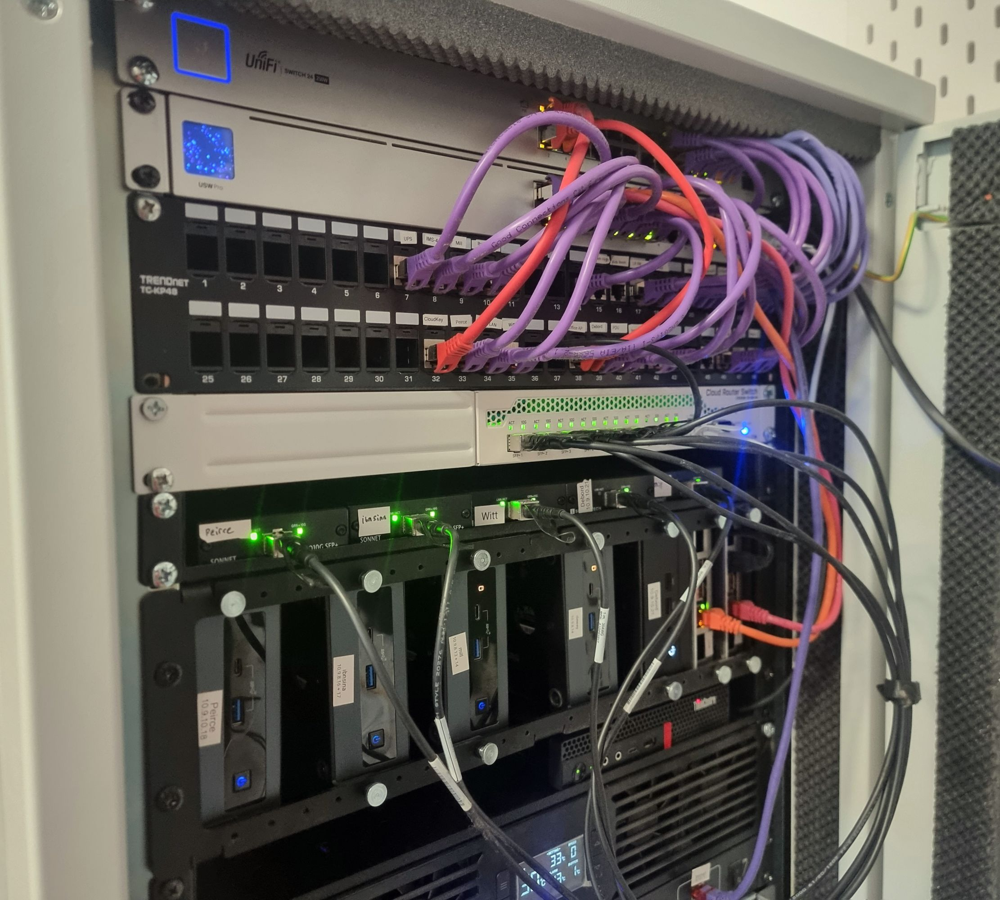
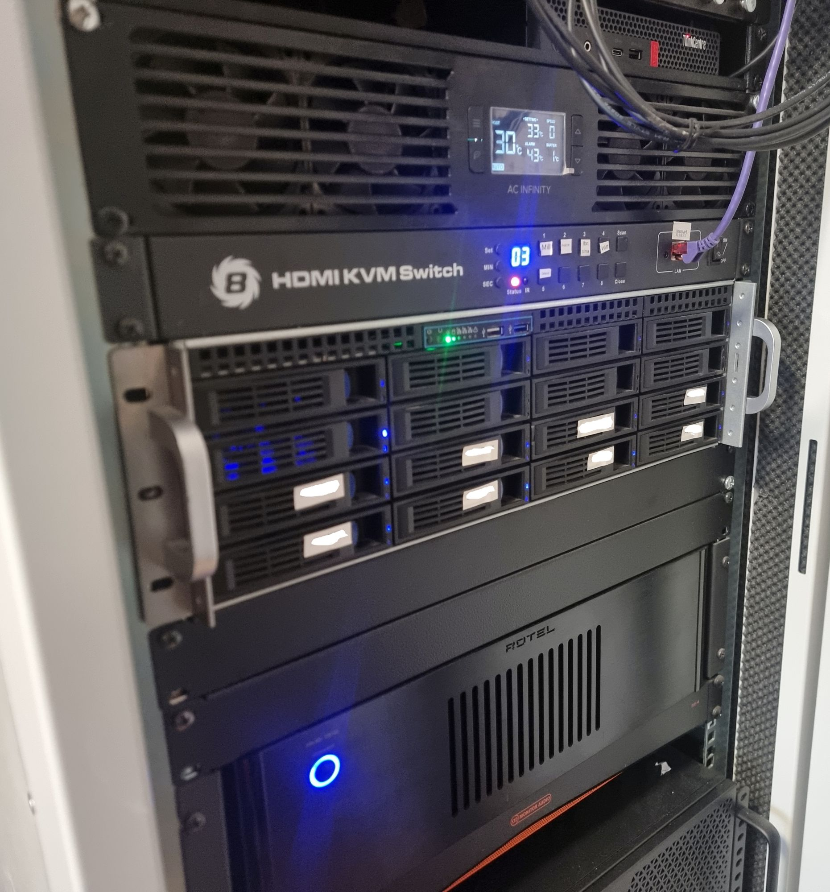
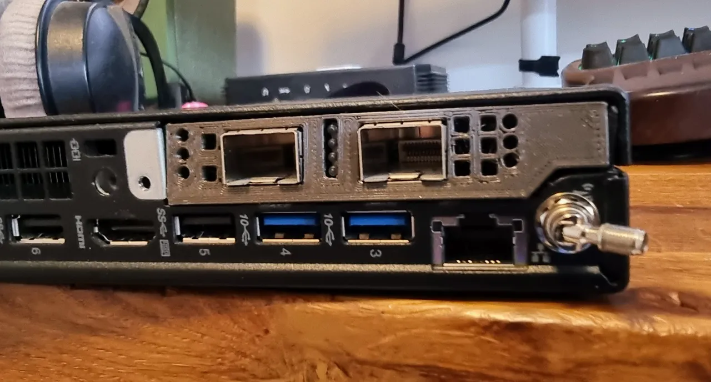

# 10GbE networking

My 10GbE network is used for Ceph and Proxmox replication. 

## 10GbE Network Hardware
| Device                               | Connection              | Card                           |
|--------------------------------------|-------------------------|--------------------------------|
| USW-Pro-24                           | SFP+                    | -                              |
| Supermicro/i3 based NAS              | SFP+                    | Intel x520 PCIe card           |
| Mikrotik CRS309-1G-8S+IN 10GB Switch | SFP+                    | -                              |
| Lenovo M720q VyOS                    | SFP+                    | Mellanox ConnectX-3 Pro CX322A |
| NUC1                                 | SFP+ over Thunderbolt 3 | Sonnet ‎SOLO10G-SFP-T3          |
| NUC2                                 | SFP+ over Thunderbolt 3 | Sonnet ‎SOLO10G-SFP-T3          |
| NUC3                                 | SFP+ over Thunderbolt 3 | Sonnet ‎SOLO10G-SFP-T3          |
| NUC4                                 | SFP+ over Thunderbolt 3 | Sonnet ‎SOLO10G-SFP-T3          |
| NUC5                                 | SFP+ over Thunderbolt 3 | Sonnet ‎SOLO10G-SFP-T3          |

## Lenovo Thinkcentre M720q

* **OS**: [VyOS Rolling](./VyOS.md)
* **Card:** Mellanox ConnectX-3 Pro CX322A SFP+

[Here is my 3D model](https://www.printables.com/model/428540-lenovo-m720q-baffle-for-melanox-cx312a-and-melanox) for the baffle I 3d printed (it's a little jank, but works!)

### Power Draw Energy Usage

## CRS309-1G-8S+IN

My CRS309-1G-8S+IN runs SwOs, so it functions as a layer 2 switch.

**Does the CRS309-1G-8S+IN support Jumbo Frames when in SwOs?**

> CRS312 device booted in SwOS by default supports jumbo frames up to 10218 bytes and you cannot change it to other values. It is the same for all CRS3xx devices booted in SwOS. -- [source](https://forum.mikrotik.com/viewtopic.php?t=154481#p763675)

So, yes. This is backed up my real-world experience too.

## Config Notes

* Enable jumbo frames, mtu=9000
  * Don't forget that every device on that vlan should have the same mtu.
