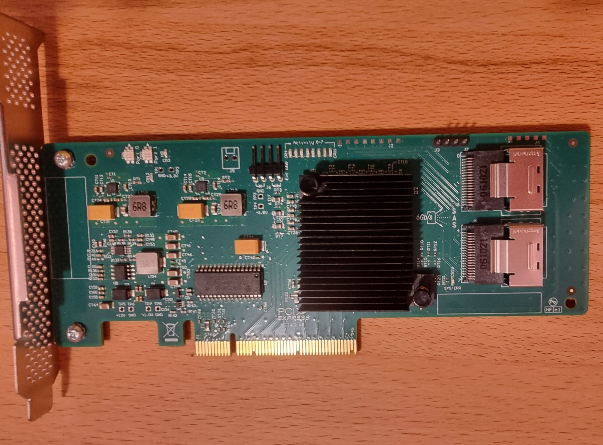

# NAS

My NAS is a self-built 3U server that runs the following services:

* NFS
* Samba
* Minio (S3-like Object Storage)
* Borgbackup repo target

## Hardware

* Original Build Date: Fall 2021
* Chassis: [Inter-tech 3U 3416](https://www.inter-tech.de/produktdetails-10/3U-3416.html)
* Motherboard: [Supermicro X11SCH-F](https://www.supermicro.com/en/products/motherboard/x11sch-f) [archive](https://web.archive.org/web/20230831132801/https://www.supermicro.com/en/products/motherboard/x11sch-f)
* CPU: Intel Core i3-8100
* RAM: 64GB, 4x Samsung 16 GB DDR4-2666 ECC UDIMM (M391A2K43BB1-CTD)
* OS: [NixOS][os] (formerly FreeNAS/TrueNAS Core)
* Network Card: Intel x520 PCIe + 2 onboard 1Gb NICs
    * MPT Firmware Revision 20.00.06.00-IR
* HBA Card: 10Gtek LSI 9211-8I 8 Port PCIEx8
* Disks:
    * 4x 8TiB Shucked Western Digital WD80EZAZ (zfs pool `tank`)
    * 7x 12 TiB Shucked Western Digital WD120EDBZ (zfs pool `tank2`)
    * 1x 12 TiB Shucked Seagate ST12000NE0008 (zfs pool `tank2`)
    * 1x 1.75 TiB M.2 Samsung MZ1LB1T9HALS Enterprise NVME (zfs pool `fast`)
    * 1x 1.82 TiB Samsung SSD 970 EVO Plus
    * 1x 111.79 GiB Intenso SSD SATAIII (OS Disk)

[os]: https://github.com/ramblurr/nixcfg


## NixOS

In the Summer of 2023 I migrated from TrueNAS Core to a custom NixOS
configuration for my NAS. You can browse the [NAS' NixOS config on
github][malinix]

The NAS' main job is to shepherd the ZFS pools, serve up NFS and a few SMB
shares. It also runs minio to provide object storage for some services in my k8s
cluster.

[zrepl](https://github.com/zrepl/zrepl) is used to replicate snapshots to an offsite TrueNAS Core.

[malinix]: https://github.com/Ramblurr/nixcfg/blob/main/hosts/stable/x86_64-linux/mali/README.md

## Fan Notes

| Fan                          | Size  | Port           |
|------------------------------|-------|----------------|
| Intake Left Disks            | 140mm | FANB           |
| Intake Center Disks          | 140mm | FANA           |
| Intake Right Disks           | 140mm | FAN2           |
| CPU Cooler                   | 80mm  | FAN1           |
| LSI 9211-8I SAS (custom mod) | 40mm  | FAN3 (3-pin)   |
| Rear Chassis Exhaust         | 40mm  | FAN4 (Y-Split) |


With Noctua fans (which spin slower than normal data-center fans) we need to adjust the sensor threshold for generating warnings.

```
 ipmitool sensor thresh FAN1 lower 150 250 300
 ipmitool sensor thresh FAN2 lower 150 250 300
 ipmitool sensor thresh FAN3 lower 150 250 300
 ipmitool sensor thresh FAN4 lower 150 250 300
 ipmitool sensor thresh FANA lower 150 250 300
 ipmitool sensor thresh FANB lower 150 250 300
```

```console
# ipmitool sensor thresh 
sensor thresh <id> <threshold> <setting>
   id        : name of the sensor for which threshold is to be set
   threshold : which threshold to set
                 unr = upper non-recoverable
                 ucr = upper critical
                 unc = upper non-critical
                 lnc = lower non-critical
                 lcr = lower critical
                 lnr = lower non-recoverable
   setting   : the value to set the threshold to

sensor thresh <id> lower <lnr> <lcr> <lnc>
   Set all lower thresholds at the same time

sensor thresh <id> upper <unc> <ucr> <unr>
   Set all upper thresholds at the same time
```


## Migrating Encrypted ZFS pool from TrueNAS Core to Linux (NixOS)

**Problem**

You want to move an encrypted ZFS pool (or pools) from TrueNAS Core to a Linux install.

**Preconditions**
* This does NOT apply to zfs pools you want to use as a root pool. This is only for other pools.
* You still have access to your TrueNAS Core install, or have backups of the keys 
* All services expecting to find data on the mounted pool are stopped/turned off.
* Your Linux install is already set to go and the disks are plugged in and `zpool import` shows your pool ready to be imported.


**Out of Scope**

This procedure *just* describes how to import and mount the pool, and does not cover migrating any data or services. If you have shares or services on TrueNAS you probably need to document them thouroughly before migrating. This includes not just app configs but also system configs (users/uids, groups/gids, etc).

**Procedure**

1. Make sure you have exported the dataset keys for any encrypted pools/datasets in TrueNAS Core
2. Did you export the dataset keys? Did you copy them somewhere safe?
3. From your new Linux install import the pool `zpool import -f -N tank` the `-N` flag ensures the datasets are not mounted to the VFS.
4. Load the key `zfs load-key tank`, enter the hexadecimal key you saved in step 1.
5. Write the encryption keys somewhere safe where only root only has read access.
5. Change the key location `zfs change-key -o keylocation=file://.... tank`
6. If you do a `zfs list -r tank` you will notice the mount point doesn't have the `/mnt` prefix that we normally see in TrueNAS Core
7. So now you want to change the mountpoint to be in `/mnt` where all your services are expecting it to be `zfs set mountpoint=/mnt/tank tank`
8. Export the pool `zpool export tank`
9. Import it again, this time omitting the `-N` flag so it mounts the datasets. Pass `-l` to load the key automatically from the new location.
    * `zpool import -l tank`

If you need to do this for multiple pools, just repeat the procedure with a different pool name.

## Notes About LSI 9211-8I SAS card

### An Unhappy HBA Card

I got my card used, who knows how long it had been used, but it was probably an old card when I got it. In the summer here the operating conditions of my network rack can be 30-35 C. Intermittently for several years I had reliability problems with this card. On TrueNAS CORE this manifested with kernel panics and spontaneous reboots. I improved the cooling situation in the chassis and that helped a little bit, but during the hot months and when there was high-load I would still get kernel panics and reboots.

Here's a screencap I managed of freebsd crashing:
{ align=left }

I ended up removing the heat sink, cleaning of the thermal epoxy and applying my
own thermal paste. I then used two female M2.5 Standoffs and M2.5 button socket
head screws to attach a Noctua 40mm fan and the heatsink to the card. Noctua is
probably over kill here, but it's what I had on hand.

Removing the heatsink was very difficult. I tried the floss method, the twist
method, and the method described in the link below. None of them worked. In the
end I put the card in an ESD bag and put it in the freezer for about half an
hour. Then I used a metal flat tool from my iFixit kit to push and twist. It
took quite a lot of force, but it came off and I was able to clean and apply the
thermal paste easily.


|                                           |                                         |
|-------------------------------------------|-----------------------------------------|
|  Pre-operation       |  The heatsink removed  |
|  Post-operation side |  Post-operation top |

??? note "Excerpts from NixOS/Linux `dmesg` (expand to see)"

        $ grep mpt2 nixos-dmesg.log
        [   12.972451] mpt2sas_cm0: 64 BIT PCI BUS DMA ADDRESSING SUPPORTED, total mem (65757976 kB)
        [   13.029300] mpt2sas_cm0: CurrentHostPageSize is 0: Setting default host page size to 4k
        [   13.029308] mpt2sas_cm0: MSI-X vectors supported: 1
        [   13.029310] mpt2sas_cm0:  0 1 1
        [   13.029393] mpt2sas_cm0: High IOPs queues : disabled
        [   13.029394] mpt2sas0-msix0: PCI-MSI-X enabled: IRQ 152
        [   13.029395] mpt2sas_cm0: iomem(0x00000000918c0000), mapped(0x00000000db264e67), size(16384)
        [   13.029398] mpt2sas_cm0: ioport(0x0000000000006000), size(256)
        [   13.094837] mpt2sas_cm0: CurrentHostPageSize is 0: Setting default host page size to 4k
        [   13.095409] mpt2sas_cm0: scatter gather: sge_in_main_msg(1), sge_per_chain(9), sge_per_io(128), chains_per_io(15)
        [   13.095433] mpt2sas_cm0: request pool(0x0000000027b2b702) - dma(0x104a00000): depth(3492), frame_size(128), pool_size(436 kB)
        [   13.108212] mpt2sas_cm0: sense pool(0x000000003e765d5b) - dma(0x104980000): depth(3367), element_size(96), pool_size (315 kB)
        [   13.108242] mpt2sas_cm0: reply pool(0x0000000043f9e61f) - dma(0x11fe80000): depth(3556), frame_size(128), pool_size(444 kB)
        [   13.108245] mpt2sas_cm0: config page(0x000000002801b94d) - dma(0x11fd46000): size(512)
        [   13.108246] mpt2sas_cm0: Allocated physical memory: size(7579 kB)
        [   13.108250] mpt2sas_cm0: Current Controller Queue Depth(3364),Max Controller Queue Depth(3432)
        [   13.108250] mpt2sas_cm0: Scatter Gather Elements per IO(128)
        [   13.178616] mpt2sas_cm0: overriding NVDATA EEDPTagMode setting
        [   13.182856] mpt2sas_cm0: LSISAS2008: FWVersion(20.00.07.00), ChipRevision(0x03), BiosVersion(07.39.02.00)
        [   13.182860] mpt2sas_cm0: Protocol=(Initiator,Target), Capabilities=(TLR,EEDP,Snapshot Buffer,Diag Trace Buffer,Task Set Full,NCQ)
        [   13.183387] mpt2sas_cm0: sending port enable !!
        [   14.796788] mpt2sas_cm0: hba_port entry: 00000000876efe7b, port: 255 is added to hba_port list
        [   14.798181] mpt2sas_cm0: host_add: handle(0x0001), sas_addr(0x500605b002c8eb51), phys(8)
        [   14.798667] mpt2sas_cm0: handle(0x9) sas_address(0x4433221100000000) port_type(0x1)
        [   15.048875] mpt2sas_cm0: handle(0xa) sas_address(0x4433221101000000) port_type(0x1)
        [   15.049498] mpt2sas_cm0: handle(0xb) sas_address(0x4433221103000000) port_type(0x1)
        [   15.050115] mpt2sas_cm0: handle(0xc) sas_address(0x4433221102000000) port_type(0x1)
        [   15.050732] mpt2sas_cm0: handle(0xd) sas_address(0x4433221104000000) port_type(0x1)
        [   15.298460] mpt2sas_cm0: handle(0xe) sas_address(0x4433221105000000) port_type(0x1)
        [   15.299286] mpt2sas_cm0: handle(0xf) sas_address(0x4433221106000000) port_type(0x1)
        [   15.300110] mpt2sas_cm0: handle(0x10) sas_address(0x4433221107000000) port_type(0x1)
        [   20.179842] mpt2sas_cm0: port enable: SUCCESS
        [  317.001498] mpt2sas_cm0: SAS host is non-operational !!!!
        [  318.025502] mpt2sas_cm0: SAS host is non-operational !!!!
        [  319.049497] mpt2sas_cm0: SAS host is non-operational !!!!
        [  320.073501] mpt2sas_cm0: SAS host is non-operational !!!!
        [  321.097496] mpt2sas_cm0: SAS host is non-operational !!!!
        [  322.121499] mpt2sas_cm0: SAS host is non-operational !!!!
        [  322.121667] mpt2sas_cm0: _base_fault_reset_work: Running mpt3sas_dead_ioc thread success !!!!
        [  322.227577] mpt2sas_cm0: mpt3sas_transport_port_remove: removed: sas_addr(0x4433221103000000)
        [  322.227579] mpt2sas_cm0: removing handle(0x000b), sas_addr(0x4433221103000000)
        [  322.227580] mpt2sas_cm0: enclosure logical id(0x500605b002c8eb51), slot(0)
        [  322.227582] mpt2sas_cm0: mpt3sas_transport_port_remove: removed: sas_addr(0x4433221100000000)
        [  322.227583] mpt2sas_cm0: removing handle(0x0009), sas_addr(0x4433221100000000)
        [  322.227584] mpt2sas_cm0: enclosure logical id(0x500605b002c8eb51), slot(3)
        [  322.227586] mpt2sas_cm0: mpt3sas_transport_port_remove: removed: sas_addr(0x4433221101000000)
        [  322.227587] mpt2sas_cm0: removing handle(0x000a), sas_addr(0x4433221101000000)
        [  322.227588] mpt2sas_cm0: enclosure logical id(0x500605b002c8eb51), slot(2)
        [  322.227589] mpt2sas_cm0: mpt3sas_transport_port_remove: removed: sas_addr(0x4433221102000000)
        [  322.227590] mpt2sas_cm0: removing handle(0x000c), sas_addr(0x4433221102000000)
        [  322.227591] mpt2sas_cm0: enclosure logical id(0x500605b002c8eb51), slot(1)
        [  322.227592] mpt2sas_cm0: mpt3sas_transport_port_remove: removed: sas_addr(0x4433221104000000)
        [  322.227593] mpt2sas_cm0: removing handle(0x000d), sas_addr(0x4433221104000000)
        [  322.227593] mpt2sas_cm0: enclosure logical id(0x500605b002c8eb51), slot(7)
        [  322.227595] mpt2sas_cm0: mpt3sas_transport_port_remove: removed: sas_addr(0x4433221105000000)
        [  322.227595] mpt2sas_cm0: removing handle(0x000e), sas_addr(0x4433221105000000)
        [  322.227596] mpt2sas_cm0: enclosure logical id(0x500605b002c8eb51), slot(6)
        [  322.227597] mpt2sas_cm0: mpt3sas_transport_port_remove: removed: sas_addr(0x4433221106000000)
        [  322.227598] mpt2sas_cm0: removing handle(0x000f), sas_addr(0x4433221106000000)
        [  322.227599] mpt2sas_cm0: enclosure logical id(0x500605b002c8eb51), slot(5)
        [  322.227600] mpt2sas_cm0: mpt3sas_transport_port_remove: removed: sas_addr(0x4433221107000000)
        [  322.227601] mpt2sas_cm0: removing handle(0x0010), sas_addr(0x4433221107000000)
        [  322.227602] mpt2sas_cm0: enclosure logical id(0x500605b002c8eb51), slot(4)
        [  322.227672] mpt2sas_cm0: unexpected doorbell active!
        [  322.227673] mpt2sas_cm0: sending diag reset !!
        [  322.381429] mpt2sas_cm0: Invalid host diagnostic register value
        [  322.381432] mpt2sas_cm0: System Register set:
        [  322.381517] mpt2sas_cm0: diag reset: FAILED

??? note "Excerpts from my TrueNAS Core 13 `dmesg` (expand to see)"

        mps0: <Avago Technologies (LSI) SAS2008> port 0x6000-0x60ff mem 0x918c0000-0x918c3fff,0x91880000-0x918bffff irq 17 at device 0.0 on pci2
        mps0: Firmware: 20.00.07.00, Driver: 21.02.00.00-fbsd
        mps0: IOCCapabilities: 1285c<ScsiTaskFull,DiagTrace,SnapBuf,EEDP,TransRetry,EventReplay,HostDisc>
            (da7:mps0:0:7:0): READ(16). CDB: 88 00 00 00 00 03 1a 02 ef 80 00 00 00 08 00 00 length 4096 SMID 784 Command timeout on target 7(0x000f) 60000 set, 60.69624489 elapsed
        ..snip.. 
        mps0: Sending abort to target 7 for SMID 784
            (da7:mps0:0:7:0): READ(16). CDB: 88 00 00 00 00 03 1a 02 ef 80 00 00 00 08 00 00 length 4096 SMID 784 Aborting command 0xfffffe01572c3d80
            (da2:mps0:0:2:0): WRITE(16). CDB: 8a 00 00 00 00 04 44 c0 43 a0 00 00 00 08 00 00 length 4096 SMID 1650 Command timeout on target 2(0x000b) 60000 set, 60.49550000 elapsed
        mps0: Sending abort to target 2 for SMID 1650
            (da2:mps0:0:2:0): WRITE(16). CDB: 8a 00 00 00 00 04 44 c0 43 a0 00 00 00 08 00 00 length 4096 SMID 1650 Aborting command 0xfffffe015730c930
            (da1:mps0:0:1:0): WRITE(16). CDB: 8a 00 00 00 00 04 45 00 3f 58 00 00 00 08 00 00 length 4096 SMID 674 Command timeout on target 1(0x000a) 60000 set, 60.183568056 elapsed
        mps0: Sending abort to target 1 for SMID 674
            (da1:mps0:0:1:0): WRITE(16). CDB: 8a 00 00 00 00 04 45 00 3f 58 00 00 00 08 00 00 length 4096 SMID 674 Aborting command 0xfffffe01572ba9b0
            (da5:mps0:0:5:0): WRITE(16). CDB: 8a 00 00 00 00 04 44 c0 43 a0 00 00 00 08 00 00 length 4096 SMID 1277 Command timeout on target 5(0x000e) 60000 set, 60.317645584 elapsed
        mps0: Sending abort to target 5 for SMID 1277
            (da5:mps0:0:5:0): WRITE(16). CDB: 8a 00 00 00 00 04 44 c0 43 a0 00 00 00 08 00 00 length 4096 SMID 1277 Aborting command 0xfffffe01572ed3f8
            (da6:mps0:0:6:0): WRITE(16). CDB: 8a 00 00 00 00 04 44 c0 43 a0 00 00 00 08 00 00 length 4096 SMID 1292 Command timeout on target 6(0x0010) 60000 set, 60.452783536 elapsed
        mps0: Sending abort to target 6 for SMID 1292
            (da6:mps0:0:6:0): WRITE(16). CDB: 8a 00 00 00 00 04 44 c0 43 a0 00 00 00 08 00 00 length 4096 SMID 1292 Aborting command 0xfffffe01572ee820
            (da0:mps0:0:0:0): WRITE(16). CDB: 8a 00 00 00 00 04 44 c0 43 a0 00 00 00 08 00 00 length 4096 SMID 1492 Command timeout on target 0(0x0009) 60000 set, 60.587930875 elapsed
        mps0: Sending abort to target 0 for SMID 1492
            (da0:mps0:0:0:0): WRITE(16). CDB: 8a 00 00 00 00 04 44 c0 43 a0 00 00 00 08 00 00 length 4096 SMID 1492 Aborting command 0xfffffe01572ff4e0
            (da7:mps0:0:7:0): WRITE(16). CDB: 8a 00 00 00 00 04 44 c0 43 a0 00 00 00 08 00 00 length 4096 SMID 1305 Command timeout on target 7(0x000f) 60000 set, 60.723052022 elapsed
            (da3:mps0:0:3:0): WRITE(16). CDB: 8a 00 00 00 00 04 44 c0 43 a0 00 00 00 08 00 00 length 4096 SMID 1291 Command timeout on target 3(0x000c) 60000 set, 60.787854603 elapsed
        mps0: Sending abort to target 3 for SMID 1291
            (da3:mps0:0:3:0): WRITE(16). CDB: 8a 00 00 00 00 04 44 c0 43 a0 00 00 00 08 00 00 length 4096 SMID 1291 Aborting command 0xfffffe01572ee6c8
            (da4:mps0:0:4:0): WRITE(16). CDB: 8a 00 00 00 00 04 44 c0 43 98 00 00 00 08 00 00 length 4096 SMID 1590 Command timeout on target 4(0x000d) 60000 set, 60.923032626 elapsed
        mps0: Sending abort to target 4 for SMID 1590
            (da4:mps0:0:4:0): WRITE(16). CDB: 8a 00 00 00 00 04 44 c0 43 98 00 00 00 08 00 00 length 4096 SMID 1590 Aborting command 0xfffffe0157307890
            (xpt0:mps0:0:7:0): SMID 1 task mgmt 0xfffffe0157282158 timed out
        mps0: Reinitializing controller

        ..snip.. 
        [   13.029300] mpt2sas_cm0: CurrentHostPageSize is 0: Setting default host page size to 4k
        [   13.094837] mpt2sas_cm0: CurrentHostPageSize is 0: Setting default host page size to 4k
        [   13.108250] mpt2sas_cm0: Current Controller Queue Depth(3364),Max Controller Queue Depth(3432)
        ..snip.. grepping for mpt2...
        [   12.972451] mpt2sas_cm0: 64 BIT PCI BUS DMA ADDRESSING SUPPORTED, total mem (65757976 kB)
        [   13.029300] mpt2sas_cm0: CurrentHostPageSize is 0: Setting default host page size to 4k
        [   13.029308] mpt2sas_cm0: MSI-X vectors supported: 1
        [   13.029310] mpt2sas_cm0:  0 1 1
        [   13.029393] mpt2sas_cm0: High IOPs queues : disabled
        [   13.029394] mpt2sas0-msix0: PCI-MSI-X enabled: IRQ 152
        [   13.029395] mpt2sas_cm0: iomem(0x00000000918c0000), mapped(0x00000000db264e67), size(16384)
        [   13.029398] mpt2sas_cm0: ioport(0x0000000000006000), size(256)
        [   13.094837] mpt2sas_cm0: CurrentHostPageSize is 0: Setting default host page size to 4k
        [   13.095409] mpt2sas_cm0: scatter gather: sge_in_main_msg(1), sge_per_chain(9), sge_per_io(128), chains_per_io(15)
        [   13.095433] mpt2sas_cm0: request pool(0x0000000027b2b702) - dma(0x104a00000): depth(3492), frame_size(128), pool_size(436 kB)
        [   13.108212] mpt2sas_cm0: sense pool(0x000000003e765d5b) - dma(0x104980000): depth(3367), element_size(96), pool_size (315 kB)
        [   13.108242] mpt2sas_cm0: reply pool(0x0000000043f9e61f) - dma(0x11fe80000): depth(3556), frame_size(128), pool_size(444 kB)
        [   13.108245] mpt2sas_cm0: config page(0x000000002801b94d) - dma(0x11fd46000): size(512)
        [   13.108246] mpt2sas_cm0: Allocated physical memory: size(7579 kB)
        [   13.108250] mpt2sas_cm0: Current Controller Queue Depth(3364),Max Controller Queue Depth(3432)
        [   13.108250] mpt2sas_cm0: Scatter Gather Elements per IO(128)
        [   13.178616] mpt2sas_cm0: overriding NVDATA EEDPTagMode setting
        [   13.182856] mpt2sas_cm0: LSISAS2008: FWVersion(20.00.07.00), ChipRevision(0x03), BiosVersion(07.39.02.00)
        [   13.182860] mpt2sas_cm0: Protocol=(Initiator,Target), Capabilities=(TLR,EEDP,Snapshot Buffer,Diag Trace Buffer,Task Set Full,NCQ)
        [   13.183387] mpt2sas_cm0: sending port enable !!
        [   14.796788] mpt2sas_cm0: hba_port entry: 00000000876efe7b, port: 255 is added to hba_port list
        [   14.798181] mpt2sas_cm0: host_add: handle(0x0001), sas_addr(0x500605b002c8eb51), phys(8)
        [   14.798667] mpt2sas_cm0: handle(0x9) sas_address(0x4433221100000000) port_type(0x1)
        [   15.048875] mpt2sas_cm0: handle(0xa) sas_address(0x4433221101000000) port_type(0x1)
        [   15.049498] mpt2sas_cm0: handle(0xb) sas_address(0x4433221103000000) port_type(0x1)
        [   15.050115] mpt2sas_cm0: handle(0xc) sas_address(0x4433221102000000) port_type(0x1)
        [   15.050732] mpt2sas_cm0: handle(0xd) sas_address(0x4433221104000000) port_type(0x1)
        [   15.298460] mpt2sas_cm0: handle(0xe) sas_address(0x4433221105000000) port_type(0x1)
        [   15.299286] mpt2sas_cm0: handle(0xf) sas_address(0x4433221106000000) port_type(0x1)
        [   15.300110] mpt2sas_cm0: handle(0x10) sas_address(0x4433221107000000) port_type(0x1)
        [   20.179842] mpt2sas_cm0: port enable: SUCCESS
        [  317.001498] mpt2sas_cm0: SAS host is non-operational !!!!
        [  318.025502] mpt2sas_cm0: SAS host is non-operational !!!!
        [  319.049497] mpt2sas_cm0: SAS host is non-operational !!!!
        [  320.073501] mpt2sas_cm0: SAS host is non-operational !!!!
        [  321.097496] mpt2sas_cm0: SAS host is non-operational !!!!
        [  322.121499] mpt2sas_cm0: SAS host is non-operational !!!!
        [  322.121667] mpt2sas_cm0: _base_fault_reset_work: Running mpt3sas_dead_ioc thread success !!!!
        [  322.227577] mpt2sas_cm0: mpt3sas_transport_port_remove: removed: sas_addr(0x4433221103000000)
        [  322.227579] mpt2sas_cm0: removing handle(0x000b), sas_addr(0x4433221103000000)
        [  322.227580] mpt2sas_cm0: enclosure logical id(0x500605b002c8eb51), slot(0)
        [  322.227582] mpt2sas_cm0: mpt3sas_transport_port_remove: removed: sas_addr(0x4433221100000000)
        [  322.227583] mpt2sas_cm0: removing handle(0x0009), sas_addr(0x4433221100000000)
        [  322.227584] mpt2sas_cm0: enclosure logical id(0x500605b002c8eb51), slot(3)
        [  322.227586] mpt2sas_cm0: mpt3sas_transport_port_remove: removed: sas_addr(0x4433221101000000)
        [  322.227587] mpt2sas_cm0: removing handle(0x000a), sas_addr(0x4433221101000000)
        [  322.227588] mpt2sas_cm0: enclosure logical id(0x500605b002c8eb51), slot(2)
        [  322.227589] mpt2sas_cm0: mpt3sas_transport_port_remove: removed: sas_addr(0x4433221102000000)
        [  322.227590] mpt2sas_cm0: removing handle(0x000c), sas_addr(0x4433221102000000)
        [  322.227591] mpt2sas_cm0: enclosure logical id(0x500605b002c8eb51), slot(1)
        [  322.227592] mpt2sas_cm0: mpt3sas_transport_port_remove: removed: sas_addr(0x4433221104000000)
        [  322.227593] mpt2sas_cm0: removing handle(0x000d), sas_addr(0x4433221104000000)
        [  322.227593] mpt2sas_cm0: enclosure logical id(0x500605b002c8eb51), slot(7)
        [  322.227595] mpt2sas_cm0: mpt3sas_transport_port_remove: removed: sas_addr(0x4433221105000000)
        [  322.227595] mpt2sas_cm0: removing handle(0x000e), sas_addr(0x4433221105000000)
        [  322.227596] mpt2sas_cm0: enclosure logical id(0x500605b002c8eb51), slot(6)
        [  322.227597] mpt2sas_cm0: mpt3sas_transport_port_remove: removed: sas_addr(0x4433221106000000)
        [  322.227598] mpt2sas_cm0: removing handle(0x000f), sas_addr(0x4433221106000000)
        [  322.227599] mpt2sas_cm0: enclosure logical id(0x500605b002c8eb51), slot(5)
        [  322.227600] mpt2sas_cm0: mpt3sas_transport_port_remove: removed: sas_addr(0x4433221107000000)
        [  322.227601] mpt2sas_cm0: removing handle(0x0010), sas_addr(0x4433221107000000)
        [  322.227602] mpt2sas_cm0: enclosure logical id(0x500605b002c8eb51), slot(4)
        [  322.227672] mpt2sas_cm0: unexpected doorbell active!
        [  322.227673] mpt2sas_cm0: sending diag reset !!
        [  322.381429] mpt2sas_cm0: Invalid host diagnostic register value
        [  322.381432] mpt2sas_cm0: System Register set:
        [  322.381517] mpt2sas_cm0: diag reset: FAILED


**Corroborating reports**

* /u/DandyPandy [Are disks just dying or might I have another problem?](https://old.reddit.com/r/zfs/comments/13gl52i/are_disks_just_dying_or_might_i_have_another/) [archive](https://web.archive.org/web/20230831132253/https://old.reddit.com/r/zfs/comments/13gl52i/are_disks_just_dying_or_might_i_have_another/)
* Unraid Forums [(Solved/Workaround)HBA/SAS Issues. Raid failing.](https://forums.unraid.net/topic/77740-solvedworkaroundhbasas-issues-raid-failing/) [archive](https://web.archive.org/web/20230831132426/https://forums.unraid.net/topic/77740-solvedworkaroundhbasas-issues-raid-failing/)
* Unraid Forums [SAS host is non-operational !!!!](https://forums.unraid.net/topic/111058-sas-host-is-non-operational/) [archive](https://web.archive.org/web/20230831132522/https://forums.unraid.net/topic/111058-sas-host-is-non-operational/)
* Kernel [Bug 209177 - mpt2sas_cm0: failure at drivers/scsi/mpt3sas/mpt3sas_scsih.c:10791/_scsih_probe()!](https://bugzilla.kernel.org/show_bug.cgi?id=209177) [archive](https://web.archive.org/web/20230831132947/https://bugzilla.kernel.org/show_bug.cgi?id=209177)

**Sources**:

* [How To : Change the heat sink TIM on an LSI SAS card](https://forums.unraid.net/topic/59856-how-to-change-the-heat-sink-tim-on-an-lsi-sas-card/) [archive](https://web.archive.org/web/2/https://forums.unraid.net/topic/59856-how-to-change-the-heat-sink-tim-on-an-lsi-sas-card/) (unfortunately the images are dead).

### Check current firmware version of LSI 9211-8I

**Goal** Check the current firmware version of your LSI 9211-8I card

**Procedure**


To enter the card's BIOS use `Ctrl+C` when you see "Avago Technologies MPT SAS2 BIOS"

Navigate through through the bios to check the version of the card.

(Note: the above screenshot may look different depending on the version of the BIOS).

(see screenshots below)


### Upgrade the firmware for LSI 9211-8I

**Goal** Upgrade the firmware on an LSI 9211-8I storage card to the latest version, in IT mode.

**Background**

My card came in IR (Integrated RAID) mode. I used this mode for a long time
without issue, though eventually I wanted to switch it IT mode to get better
support on Linux.

Why did I want to update?

1. In Linux udev will register `/dev/disk/by-id` names for the drives that contain the model and serial number. In IR mode udev only created `wwn-` entries.
2. Support for `sg_utils` is better.

**Procedure**

Write files to USB Stick:

1. Flash USB Stick with MBR partition scheme and a fat32 partition
2. Copy the files:

```
$ cd /run/media/ramblurr/SASFLASH/
$ tree             
./
├── boot/
│   └── efi/
│       └── ShellX64.efi
├── efi/
│   └── boot/
│       └── ShellX64.efi
├── 2118it.bin
├── mptsas2.rom
├── sas2flash.efi
└── ShellX64.efi
```

Obtain a UEFI 2.0 Shell (on my Supermicro motherboard)

1. Boot machine
2. F11 to load boot menu
3. Select UEFI SHELL
4. Wait..
5. Press ESC quickly to load the shell

Launch UEFI 1.x Shell:

1. use `mount` to get a list of devices
2. `mount fs0:` to mount one that looks like a usb stick
3. `fs0:` to cd into it
4. `ls` to see if you recognize the files, if not try another mount point
5. Enter the V1 Shell `ShellX64.efi`

Once you are in the UEFI v1 Shell:

1. Repeat the previous steps 1-4 to find the usb stick again (for me it changed for some reason)
2. Once you are in the mounted stick and see your firmware files, continue
3. Erase the controller flash memory: `sas2flash.efi -o -e 6`
    * DO NOT REBOOT OR POWEROFF AFTER RUNNING THIS, or you might have a bricked card.
4. Write the new firmware to the flash: `sas2flash.efi -o -f 2118it.bin -b mptsas2.rom`
    * Some users report you can omit the `-b mptsas2.rom` to skip installing the BIOS, this will reduce boot time, but then you lose access to the nice BIOS utility for the card.
 
 **Screenshots of the process**
 
Booting into the card's bios


Before the update:


Some thrilling 'caps of the flashing process


After the flash, you can return to the BIOS to see the updated version:


 
### Problem:  `InitShellApp: Application not started from Shell`
 
 **Symptom** Trying to run `sas2flash.efi` from your motherboard's UEFI shell results in `InitShellApp: Application not started from Shell`
 
 **Problem** Your motherboard's UEFI shell is too new.
 
 **Resolution** Boot an older UEFI shell. 
 
 See above (Launch UEFI 1.x Shell). On my motherboard I had success with this shell:
 
 https://github.com/tianocore/edk2/blob/UDK2018/EdkShellBinPkg/FullShell/X64/Shell_Full.efi
 
 download mirror: [./UDK2018-FullShell-X64-Shell_Full.efi](./UDK2018-FullShell-X64-Shell_Full.efi)

 ```console
 $ sha256sum UDK2018-FullShell-X64-Shell_Full.efi 
 ea5e763a8a5f9733dbf7c33ffa16a19e078c6af635b51d8457bc377a22106a8c  UDK2018-FullShell-X64-Shell_Full.efi
 ```
 
### Question: Can I switch from IR->IT firmware with existing ZFS?
 
 **Preconditions**: You have an existing ZFS pool using a SAS9211-8I card in IR mode. You want to switch to IT mode. You are not sure if this is a good idea.
 
 **Question**: Will your ZFS pool still be accessible after the switch to IT mode?
 
 **Answer**: Probably? It's hard to give pure factual statements, but here is some anecdata:


* Several users on STH Forum said it worked, although they used different cards than the SAS9211-8I  [source](https://forums.servethehome.com/index.php?threads/can-i-switch-from-ir-it-firmware-with-zfs-on-linux-answer-yes.20286/) [archive](https://web.archive.org/web/20191125205553/https://forums.servethehome.com/index.php?threads/can-i-switch-from-ir-it-firmware-with-zfs-on-linux-answer-yes.20286/)

* In 2023-08 I performed this upgrade myself without issue from `MPT Firmware Revision 20.00.06.00-IR` to `20.00.07.00-IT` on TrueNAS Core (FreeBSD) on TrueNAS Core (FreeBSD) (though I switched away from FreeBSD because of the bug discussed below.
 
### Sources
 
 * [How-to: Flash LSI 9211-8i using EFI shell](https://www.truenas.com/community/threads/how-to-flash-lsi-9211-8i-using-efi-shell.50902/) [archive](https://web.archive.org/web/20230610212842/https://www.truenas.com/community/threads/how-to-flash-lsi-9211-8i-using-efi-shell.50902/)
 * [Flashing IT Firmware to the LSI SAS9211-8i HBA](https://brycv.com/blog/2012/flashing-it-firmware-to-lsi-sas9211-8i/) [archive](https://web.archive.org/web/20230729105038/https://brycv.com/blog/2012/flashing-it-firmware-to-lsi-sas9211-8i/)
 * [Archlinux Wiki > Obtaining UEFI Shell](https://wiki.archlinux.org/title/Unified_Extensible_Firmware_Interface#Obtaining_UEFI_Shell) [archive](https://web.archive.org/web/20230831130238/https://wiki.archlinux.org/title/Unified_Extensible_Firmware_Interface)
* [Official Instructions (for older version!!)](https://www.broadcom.com/support/knowledgebase/1211161495925/flash-upgrading-firmware-on-lsi-sas-hbas-upgraded-firmware-on-92) [archive](https://web.archive.org/web/20230222184903/https://www.broadcom.com/support/knowledgebase/1211161495925/flash-upgrading-firmware-on-lsi-sas-hbas-upgraded-firmware-on-92)


## Other

```
lsblk -a -o NAME,SIZE,VENDOR,NAME,MODEL,PARTLABEL

mpsutil show all

mprutil show expanders

https://bugs.freebsd.org/bugzilla/show_bug.cgi?id=224496


https://bugs.freebsd.org/bugzilla/show_bug.cgi?id=224496#c41
Symptom:
CAM retry and timeout messages leading to controller aborts and resets

Cause:
slow disks or using SMR disks

Workaround:
Increase the CAM timeout defaults

❯ sysctl kern.cam.da.default_timeout=90
kern.cam.da.default_timeout: 60 -> 90
❯ sysctl kern.cam.ada.default_timeout=60
kern.cam.ada.default_timeout: 30 -> 60

And disable NCQ on SMR Seagates:
❯ cat cam-tags.sh
#!/usr/local/bin/bash
#shrinking the command Native Command Queue down to 1 effectively disabling queuing
for Disk in `camcontrol devlist | grep "ST8000DM" | cut -d"," -f2 | cut -d")" -f1`;
do
    camcontrol tags $Disk -N 1 ;
    # camcontrol tags $Disk -v
done

If you only have SMRs in your setup and use an UPS you could also:
❯ sysctl vfs.zfs.cache_flush_disable=1

Solution:
don't use slow disks and SMRs disks with ZFS
```
