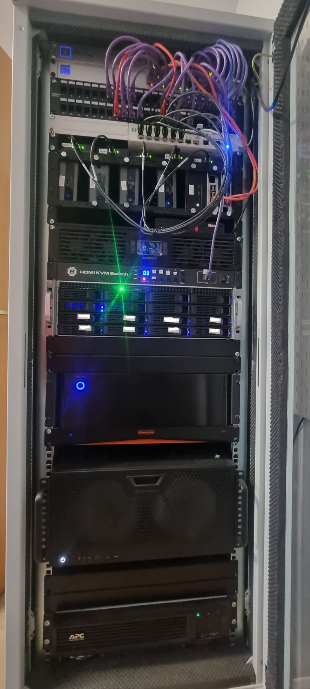

<figure markdown>
{ width="200" }
  <figcaption><h1>Home Ops</h1></figcaption>
</figure>


[](https://discord.gg/k8s-at-home)
[](https://discord.gg/U3Gvr54VRp)
[](https://www.talos.dev/)
[][0]

---

# :book:&nbsp; Overview

👋 Welcome to my home operations documentation.

My [home-ops repo][0] contains the configuration for my bare-metal servers,
virtual machines, proxmox cluster, k8s cluster, dns, and more. Also check out
[ramblurr/nixcfg](https://github.com/ramblurr/nixcfg) for my NixOS configuration
for various hosts.

## :wrench:&nbsp; Tools

My primary tools for managing my infra:

| Tool      | Purpose                                     |
|-----------|---------------------------------------------|
| ansible   | configure the  servers                      |
| sops      | encrypt secrets on disk                     |
| terraform | Configuring a few cloud resources I rely on |
| flux      | For gitopsing my k8s cluster                |
| nixos     | because nix is life                         |

## 🔧 Hardware

### Compute and Storage

| Device                                  | Count | OS Disk Size          | Data Disk Size                           | Ram    | Purpose                                                                                  |
|-----------------------------------------|-------|-----------------------|------------------------------------------|--------|------------------------------------------------------------------------------------------|
| [Supermicro X11SCH-F, Intel Core i3-8100](./NAS) | 1     | 512GB SSD             | 4x8TB ZFS, 8x12 TB ZFS, 2x1.8TB NVME ZFS | 64GB ECC   | [NAS](./NAS)                                                                                      |
| Intel NUC 10 i7FNH                      | 3     | 256 GB NVMe (via USB) | 2TB NVMe Ceph, 2TB SDD Ceph              | 64GB   | [Proxmox][proxmox] Hypervisor, [Talos][talos], [Ceph][ceph] Nodes                        |
| Intel NUC 10 i5FNH                      | 1     | 256 GB NVMe (via USB) | 800MB NVMe Ceph, 2TB SDD Ceph            | 64GB   | Proxmox Hypervisor, [Talos][talos], [Ceph][ceph]  Nodes                                  |
| Intel NUC 12 WSH i50002                 | 1     | 256 GB                | 800MB NVMe Ceph, 2TB SSD Ceph            | 64GB   | Proxmox Hypervisor, [Talos][talos], [Ceph][ceph] Nodes                                   |
| Raspberry PI 3 B                        | 3     | 8GB MMC               | N/A                                      | 512 MB | dns1, dns2, wan-lte-failover                                                             |
| Raspberry PI 4                          | 4     | 8GB MMC               | N/A                                      | 2GB    | [octoprint][octoprint], [mycroft/ovos][ovos], [zigbee2mqtt][zigbee2mqtt], [pikvm][pikvm] |

[proxmox]: https://www.proxmox.com/en/
[zigbee2mqtt]: https://www.zigbee2mqtt.io/
[pikvm]: https://www.pikvm.io
[octoprint]: https://octoprint.org/
[ovos]: https://openvoiceos.github.io/community-docs/
[talos]: https://talos.dev
[ceph]: https://ceph.io

??? note "Click to see the rack!"

    


### Networking

| Device                                                           | Count |
|------------------------------------------------------------------|-------|
| ISP Modem (1Gbit⬇/100Mbit⬆)                                      | 1     |
| Lenovo M720q VyOS router (i5-8400T, 8GB DDR4)                    | 1     |
| Unifi Switch 24 port POE                                         | 1     |
| Unifi Switch Pro 24 port                                         | 1     |
| Unifi Switch 8 port POE                                          | 2     |
| Unifi Switch Flex                                                | 2     |
| Unifi AP AC-lite                                                 | 2     |
| Unifi Access Point U6 Lite                                       | 1     |
| Unifi Cloud Key                                                  | 1     |
| Unifi In-Wall HD Access Point                                    | 1     |
| Mikrotik CRS309-1G-8S+IN 10GB Switch                             | 1     |
| Raspberry PI 3 B - [WAN2 failover - LTE](rpi-usg-4g-failover.md) | 1     |
| Raspberry PI 3 B - DNS nodes                                     | 2     |
| PiKVM Raspberry Pi 4 2GB                                         | 1     |
| TESMART Managed multiport KVM switch                             | 1     |

[:arrow_right: More info on my 10GbE setup](10GbE.md)
## ☁️ Cloud Dependencies

While most of my infrastructure and workloads are selfhosted I do rely upon the cloud for certain key parts of my setup. This saves me from having to worry about two things. (1) Dealing with chicken/egg scenarios and (2) services I critically need whether my cluster is online or not.

The alternative solution to these two problems would be to host a Kubernetes cluster in the cloud and deploy applications like [HCVault](https://www.vaultproject.io/), [Vaultwarden](https://github.com/dani-garcia/vaultwarden), [ntfy](https://ntfy.sh/), and [Gatus](https://gatus.io/). However, maintaining another cluster and monitoring another group of workloads is a lot more time and effort than I am willing to put in.

| Service                                      | Use                                                                        | Cost           |
|----------------------------------------------|----------------------------------------------------------------------------|----------------|
| [1Password](https://1password.com/)          | Family Plan. Secrets with [External Secrets](https://external-secrets.io/) | ~$72/yr        |
| [Cloudflare](https://www.cloudflare.com/)    | DNS management, Argo Tunnels and R2                                        | ~$30/yr        |
| [GitHub](https://github.com/)                | Hosting this repository and continuous integration/deployments             | Free           |
| [Migadu](https://migadu.com/)                | Email hosting, personal, family, and business                              | ~$90/yr        |
| [NextDNS](https://nextdns.io/)               | My downstream DNS server which includes AdBlocking                           | ~$20/yr        |
| [Pushover](https://pushover.net/)            | Kubernetes Alerts and application notifications                            | Free           |
| [Terraform Cloud](https://www.terraform.io/) | Storing Terraform state                                                    | Free           |
|                                              |                                                                            | Total: ~$18/mo |

---

## ⛵ Kubernetes

There is a template over at [onedr0p/flux-cluster-template](https://github.com/onedr0p/flux-cluster-template) if you wanted to try and follow along with some of the practices I use here. Though my setup is custom and doesn't follow the template that closely.

### Installation

My cluster is [Talos](https://www.talos.dev/) provisioned overtop my Proxmox
cluster. This is a semi hyper-converged cluster, workloads and block storage
are sharing the same available resources on my nodes while I have a [separate
NAS](https://notes.binaryelysium.com/HomeOps/NAS/) for (NFS) file storage.

🔸 _[Click here](./ansible/) to see my Ansible playbooks and roles._

### Core Components

- [actions-runner-controller](https://github.com/actions/actions-runner-controller): self-hosted Github runners
- [cilium](https://github.com/cilium/cilium): internal Kubernetes networking plugin
- [cert-manager](https://cert-manager.io/docs/): creates SSL certificates for services in my cluster
- [external-dns](https://github.com/kubernetes-sigs/external-dns): automatically syncs DNS records from my cluster ingresses to a DNS provider
- [external-secrets](https://github.com/external-secrets/external-secrets/): managed Kubernetes secrets using [1Password Connect](https://github.com/1Password/connect).
- [ingress-nginx](https://github.com/kubernetes/ingress-nginx/): ingress controller for Kubernetes using NGINX as a reverse proxy and load balancer
- [rook](https://github.com/rook/rook): distributed block storage for persistent storage. I use a Ceph cluster external to the cluster, running on Proxmox.
- [sops](https://toolkit.fluxcd.io/guides/mozilla-sops/): managed secrets for Kubernetes, Ansible and Terraform which are commited to Git
- [volsync](https://github.com/backube/volsync) and [snapscheduler](https://github.com/backube/snapscheduler): backup and recovery of persistent volume claims

### GitOps

[Flux](https://github.com/fluxcd/flux2) watches my [k8s/k8s-prod](./k8s/k8s-prod/) folder (see Directories below) and makes the changes to my cluster based on the YAML manifests.

The way Flux works for me here is it will recursively search the
[k8s/k8s-prod/workloads](./k8s/k8s-prod/workloads) folder until it finds the
most top level `kustomization.yaml` per directory and then apply all the
resources listed in it. That aforementioned `kustomization.yaml` will generally
only have a namespace resource and one or many Flux kustomizations. Those Flux
kustomizations will generally have a `HelmRelease` or other resources related to
the application underneath it which will be applied.

[Renovate](https://github.com/renovatebot/renovate) watches my **entire**
repository looking for dependency updates, when they are found a PR is
automatically created. When some PRs are merged
[Flux](https://github.com/fluxcd/flux2) applies the changes to my cluster.

### Directories

This Git repository contains the following directories under [kubernetes](./kubernetes/).

```sh
📁 k8s/k8s-prod    # Kubernetes cluster defined as code
├─📁 bootstrap     # Flux installation
├─📁 flux          # Main Flux configuration of repository
└─📁 workloads     # Apps deployed into my cluster grouped by namespace
```

---

## 🌐 DNS

### Home DNS

I have two Raspberry PI 3s running CoreDNS that serve as the main DNS provider for my network. In my k8s cluster `external-dns` is deployed with the `RFC2136` provider which syncs DNS records to `bind9`.

For downstream DNS I use [NextDNS](https://nextdns.io/) which provides adblocking.

### Public DNS

Outside the `external-dns` instance mentioned above another instance is deployed
in my cluster and configure to sync DNS records to
[Cloudflare](https://www.cloudflare.com/). The only ingresses this
`external-dns` instance looks at to gather DNS records to put in `Cloudflare`
are ones that have an ingress class name of `external` and an ingress annotation
of `external-dns.alpha.kubernetes.io/target`.

---

## :handshake:&nbsp; Thanks


Thanks to all the people who donate their time to the [Kubernetes @Home](https://discord.gg/k8s-at-home) Discord community. A lot of inspiration for my cluster comes from the people that have shared their clusters using the [k8s-at-home](https://github.com/topics/k8s-at-home) GitHub topic. Be sure to check out the [Kubernetes @Home search](https://nanne.dev/k8s-at-home-search/) for ideas on how to deploy applications or get ideas on what you can deploy.

And also a big thanks to the great community from the [Self-Hosted Podcast](https://www.jupiterbroadcasting.com/show/self-hosted/) (and Jupiter Broadcasting in general!). It's a friendly community of FOSS, Linux, Self-Hosting advocates.

---

## 🤔 Still interested?

Here's a few more things to check out:

* My [NAS](./NAS) which I migrated from TrueNAS Core to NixOS
* My [Router](./VyOS) which runs VyOS. I know Opnsense is all the hype these days, but I really think VyOS can't be beat.
* My [10GbE](./10GbE) setup.
* I have a lot of [IoT projects](../IoT Projects/) around the house


### 🔏 License

Different parts of my [home-ops repo][0] have different licenses. Refer to the LICENSE file in the various subdirectories.

<div>Datacenter iconmade by <a href="https://creativemarket.com/eucalyp" title="Eucalyp">Eucalyp</a> from <a href="https://www.flaticon.com/" title="Flaticon">www.flaticon.com</a></div>

[0]: https://github.com/ramblurr/home-ops
